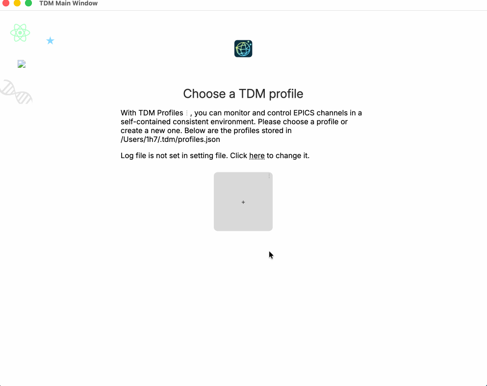
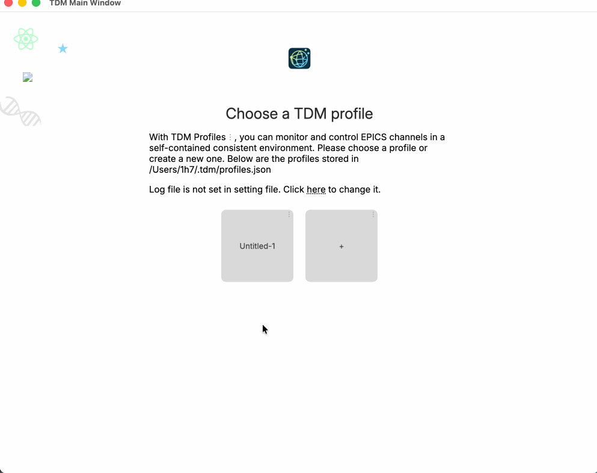

Download the latest TDM release from https://github.com/diverhao/tdm/releases. TDM provides 6 versions for
 - Window with Intel or Arm CPU
 - Linux with Intel or Arm CPU
 - MacOS with Intel or M (Arm) CPU

For MacOS M-chip CPU, download the `TDM-2025.12.0-arm64.dmg`. Install to `/Applications`.

Open the software, create a profile, create a simple display for testing purpose:



Quit and re-open TDM, configure the TDM:
 - rename the profile
 - set `EPICS_CA_ADDR_LIST`, e.g. add the EPICS gateway for SNS
 - set default TDL file, we use the TDL file just created
 - set up web server



Quit TDM, run the web server in command line (TDM is packaged with a web server):

```
/Applications/TDM.app/Contents/MacOS/TDM --main-process-mode web
```

You may see the below text in command line, you can find the web server port number:

```
[2026-02-20T17:19:56.022Z] [info] -1 Input arguments: {
  macros: [],
  settings: '/Users/1h7/.tdm/profiles.json',
  profile: '',
  alsoOpenDefaults: false,
  fileNames: [],
  attach: -1,
  flexibleAttach: true,
  cwd: '/Users/1h7',
  mainProcessMode: 'web',
  httpServerPort: 3000,              <----------- port for web server
  site: 'sns-office-engineer'
}
```

In your web browser, input

```
https://localhost:3000
```

you will see the default TDL file defined above.


